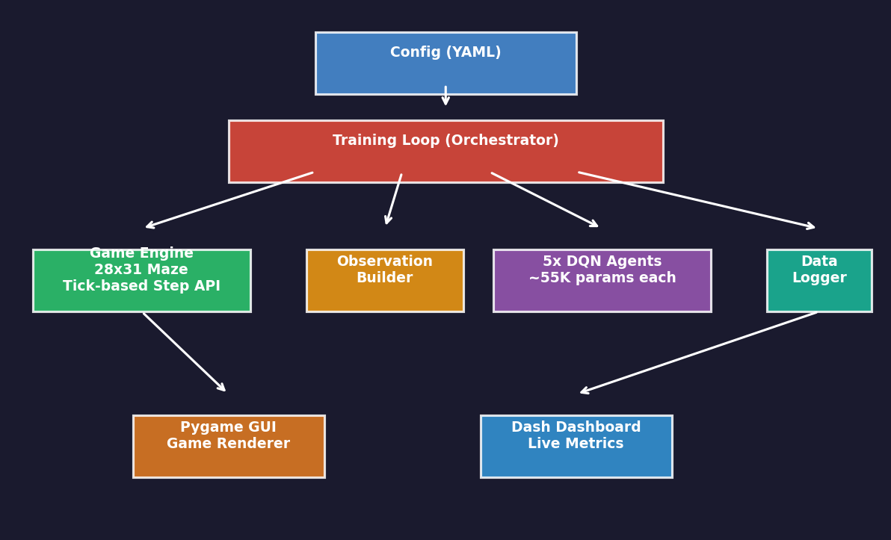
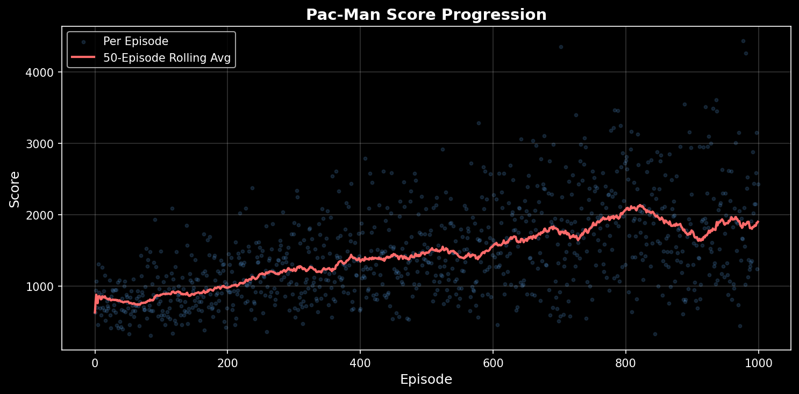
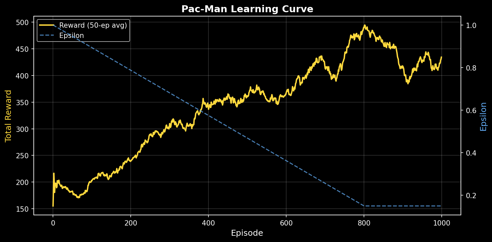
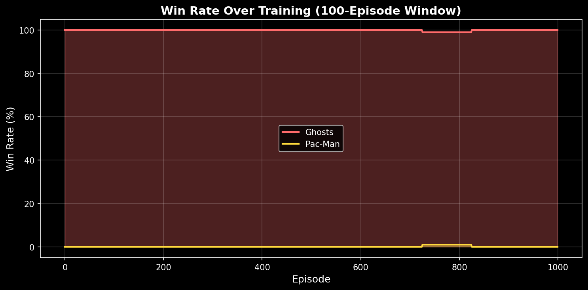
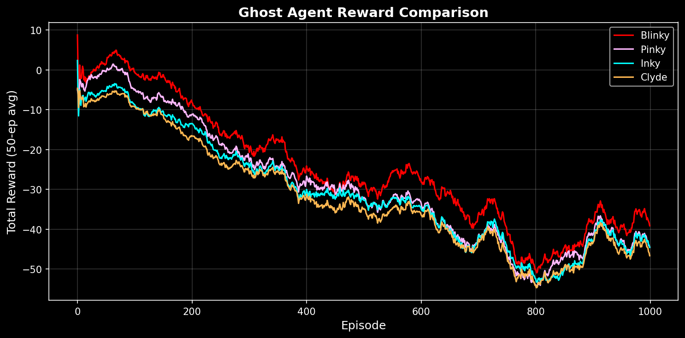

# Pac-Man AI Simulator

A research-grade Pac-Man simulator where **5 independent DQN agents** (1 Pac-Man + 4 ghosts) learn to play through continuous self-play. Built for studying multi-agent adversarial dynamics in a classic game environment.



## Features

- **5 Independent Learning Agents** — Pac-Man and each ghost (Blinky, Pinky, Inky, Clyde) have their own DQN network, replay buffer, and optimizer
- **Classic Pac-Man Mechanics** — 28x31 maze, pellets, power pellets, ghost house, scatter/chase modes, frightened mode, tunnels, fruit spawning
- **Self-Play Training** — agents improve simultaneously through adversarial interaction
- **Live GUI** — Pygame renderer for watching trained agents play
- **Web Dashboard** — Dash/Plotly dashboard with live training metrics
- **Data Persistence** — SQLite metrics database for post-training analysis
- **Checkpoint/Resume** — save and restore training from any episode

## Training Results (1,000 Episodes)

| Metric | Value |
|--------|-------|
| Total Episodes | 1,000 |
| Avg Score | 1,460 |
| Max Score | 4,440 |
| Pac-Man Wins | 1 (0.1%) |
| Ghost Wins | 999 (99.9%) |
| Avg Pellets Eaten | 124 / 244 |
| Training Speed | ~3.0 ep/s on CPU |

### Score Progression

Pac-Man's score steadily improves from ~600 to ~2,000 over training, with peak scores reaching 4,440. No policy collapse observed with the tuned hyperparameters.



### Pac-Man Learning Curve

Pac-Man's total reward increases as epsilon (exploration rate) decays from 1.0 to 0.15. The reward curve shows continuous improvement without collapse — a key stability achievement after multiple rounds of hyperparameter tuning.



### Win Rate

Ghosts dominate with ~99-100% win rate. Pac-Man briefly achieves 1% win rate around episode 730 — clearing all 244 pellets while surviving 4 learning ghost agents is extremely difficult.



### Ghost Agent Comparison

Blinky (red) consistently outperforms other ghosts, followed by Pinky. Inky and Clyde perform worst, reflecting their starting positions deeper in the ghost house and later activation.



## Quick Start

### Install

```bash
pip install -r requirements.txt
```

### Train

```bash
# Headless training (1,000 episodes)
python scripts/train.py

# Resume from checkpoint
python scripts/train.py --resume --run-dir runs/run_YYYYMMDD_HHMMSS

# Custom episode count
python scripts/train.py --episodes 5000
```

### Watch Trained Agents Play

```bash
python scripts/watch.py --run-dir runs/run_YYYYMMDD_HHMMSS --fps 10
```

### Live Dashboard

```bash
python scripts/dashboard.py --run-dir runs/run_YYYYMMDD_HHMMSS
# Open http://localhost:8050
```

### Evaluate (No Exploration)

```bash
python scripts/evaluate.py --run-dir runs/run_YYYYMMDD_HHMMSS --episodes 100
```

## Architecture

```
Config (YAML)
    |
Training Loop (Orchestrator)
    |--- Game Engine      (pure Python, tick-based, Gym-like step() API)
    |--- Observation Builder  (game state -> per-agent feature vectors)
    |--- 5x DQN Agents   (independent networks, replay buffers, optimizers)
    |--- Data Logger      (SQLite metrics)
    |--- GUI              (Pygame game view + Dash web dashboard)
```

### DQN Agent Architecture

Each agent uses the same network architecture with independent weights:

```
Input (51 features for Pac-Man, 39 for ghosts)
  -> Dense(256, ReLU)
  -> Dense(128, ReLU)
  -> Dense(64, ReLU)
  -> Dense(4)  # Q-values for [UP, DOWN, LEFT, RIGHT]

~55K parameters per agent, ~275K total
```

**Key DQN components:**
- Target network with soft updates (Polyak averaging, tau=0.005)
- Experience replay buffer (100K transitions, pre-allocated numpy arrays)
- Epsilon-greedy exploration with action masking (illegal moves set to -inf)
- Huber loss with gradient clipping (max norm 1.0)

### Observation Design

**Pac-Man** (51 features): normalized position, wall sensors, per-ghost relative position + mode one-hot (x4), nearest pellet/power pellet direction, pellet density by quadrant, game progress, fruit info.

**Ghost** (39 features): own position + mode, wall sensors, Pac-Man relative position + power-up flag, teammate positions + modes (x3), scatter target direction, game state.

Ghost modes are encoded as raw state — Pac-Man is **not** told what modes mean. It must learn through reward that frightened ghosts are edible.

### Reward Design

**Pac-Man rewards:**

| Event | Reward |
|-------|--------|
| Eat pellet | +3.0 |
| Eat power pellet | +5.0 |
| Eat ghost | +10.0 |
| Eat fruit | +5.0 |
| Clear level | +50.0 |
| Caught by ghost | -5.0 |
| Game over | -10.0 |
| Time step | -0.05 |
| Pellet proximity | +0.05 / distance |

**Ghost rewards:**

| Event | Reward |
|-------|--------|
| Catch Pac-Man (self) | +10.0 |
| Team catches Pac-Man | +3.0 |
| Ghosts win (game over) | +15.0 |
| Pac-Man eats pellet | -0.5 |
| Pac-Man clears level | -15.0 |
| Got eaten | -5.0 |
| Proximity to Pac-Man | +0.1 / distance |

## Configuration

All hyperparameters are in `config/default.yaml`:

```yaml
agent:
  learning_rate: 0.0003
  batch_size: 64
  gamma: 0.95
  epsilon_start: 1.0
  epsilon_end: 0.15
  epsilon_decay_episodes: 800
  replay_buffer_size: 100000
  hidden_sizes: [256, 128, 64]

training:
  num_episodes: 5000
  checkpoint_every: 100
  max_steps_per_episode: 3000
```

## Project Structure

```
pacman-ai/
├── config/default.yaml          # All hyperparameters
├── src/
│   ├── engine/                  # Pure game logic (no ML dependencies)
│   │   ├── constants.py         # Enums, maze dimensions, scoring
│   │   ├── maze_data.py         # Classic 28x31 maze layout
│   │   ├── maze.py              # Maze queries, pellet tracking
│   │   ├── entities.py          # Pac-Man, Ghost, Fruit classes
│   │   └── game.py              # GameState with step() API
│   ├── agents/                  # DQN agent implementation
│   │   ├── dqn_agent.py         # Full DQN with target network
│   │   ├── networks.py          # Q-Network MLP
│   │   ├── replay_buffer.py     # Pre-allocated numpy buffer
│   │   └── observations.py      # State -> feature vector builders
│   ├── training/                # Training orchestration
│   │   ├── trainer.py           # Main training loop
│   │   ├── evaluator.py         # Eval mode (no exploration)
│   │   └── checkpoint.py        # Save/load agent states
│   ├── gui/                     # Visualization
│   │   ├── renderer.py          # Pygame game renderer
│   │   ├── sprites.py           # Entity drawing primitives
│   │   └── dashboard.py         # Dash web dashboard
│   ├── data/                    # Persistence
│   │   ├── logger.py            # SQLite writer
│   │   ├── analyzer.py          # Read-only query interface
│   │   └── schemas.py           # DB schema definitions
│   └── utils/                   # Config, seeding, device selection
├── scripts/                     # Entry points
│   ├── train.py                 # Headless training
│   ├── watch.py                 # Pygame GUI viewer
│   ├── dashboard.py             # Web metrics dashboard
│   └── evaluate.py              # Evaluation runner
├── tests/                       # 54 tests (pytest)
├── requirements.txt
└── pyproject.toml
```

## Tech Stack

- **Python 3.11+**
- **PyTorch** — DQN networks (CPU optimized for small models)
- **Pygame** — game rendering
- **Dash + Plotly** — web metrics dashboard
- **SQLite** — metrics storage
- **NumPy** — array operations, replay buffer
- **pytest** — testing

## Known Limitations & Future Work

The current vanilla DQN setup learns pellet-eating behavior but struggles to consistently clear all 244 pellets against 4 learning ghost agents. Planned improvements:

- **Double DQN** — reduce Q-value overestimation
- **Richer observations** — look-ahead features, movement history, corridor awareness
- **Anti-oscillation penalties** — prevent degenerate looping policies
- **Prioritized experience replay** — learn more from surprising transitions
- **Longer training runs** — 5,000-10,000 episodes for deeper convergence
- **Ghost curriculum** — start with weaker ghosts and increase difficulty

## License

MIT
