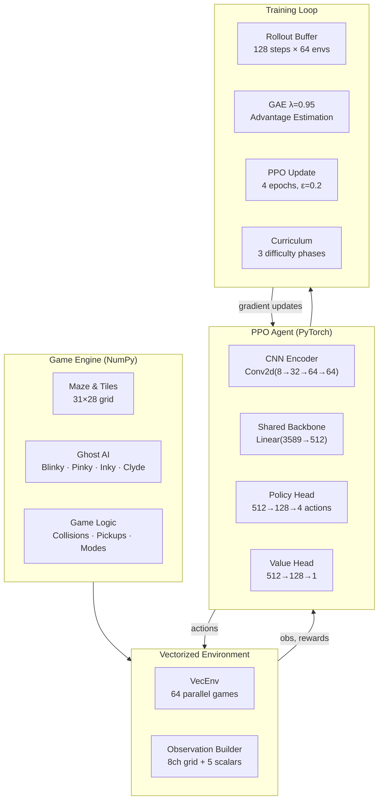
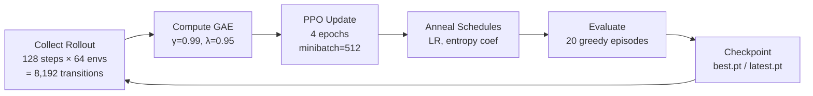
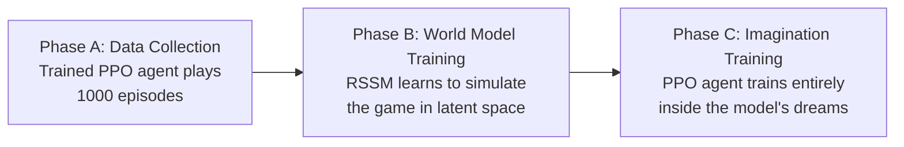

# Pac-Man AI

A deep reinforcement learning agent that learns to play Pac-Man from scratch using **Proximal Policy Optimization (PPO)** with convolutional neural network observations on a fully vectorized game engine. Includes a **world model (RSSM)** that learns to simulate the game in latent space, enabling imagination-based training.

<div align="center">

```
 ╔══════════════════════════════╗
 ║ ····█·····██·····█····       ║
 ║ ·██·█·███·██·███·█·██·      ║
 ║ ●··········ᗧ··········●     ║
 ║ ·██·█·██████████·█·██·      ║
 ║ ····█····█ᗣᗣᗣᗣ█····█····   ║
 ║ ████████·█      █·████████  ║
 ║         ·█ ᗣ  ᗣ █·          ║
 ║ ████████·████████·████████  ║
 ║ ····█····················   ║
 ╚══════════════════════════════╝
```

**79 tests passing** · **2,800+ fps** · **128 parallel environments** · **PPO + CNN + World Model**

</div>

---

## What This Project Does

This project trains an AI agent to play the classic arcade game Pac-Man using modern deep reinforcement learning. The agent:

- **Sees** the maze as an 8-channel image (walls, pellets, ghosts, etc.)
- **Decides** which direction to move using a neural network policy
- **Learns** from millions of game steps across 64 simultaneous games
- **Improves** through a 3-phase curriculum: easy ghosts → full AI → maximum difficulty

The entire game engine is built from scratch in NumPy, and the agent is trained using PyTorch with Apple Silicon (MPS) acceleration.

---

## Architecture



---

## How It Works

### Observation Space

The agent sees the game as a multi-channel image, similar to how a CNN processes RGB images:

| Channel | What It Sees | Why It Matters |
|---------|-------------|----------------|
| 0 | Walls | Navigate the maze |
| 1 | Pac-Man position | Know where you are |
| 2 | Pellets | Find food to eat |
| 3 | Power pellets | Strategic power-ups |
| 4 | Dangerous ghosts | Threats to avoid |
| 5 | Edible ghosts | Targets to chase |
| 6 | Ghost house | Restricted zone |
| 7 | Fruit | Bonus points |

Plus **5 scalar features**: power timer, lives, ghosts eaten, progress, and **current direction** (prevents oscillation).

### Neural Network

```
Input: 8×31×28 grid + 5 scalars
  │
  ├─ Conv2d(8→32, 3×3, stride=1)  → ReLU
  ├─ Conv2d(32→64, 3×3, stride=2) → ReLU
  ├─ Conv2d(64→64, 3×3, stride=2) → ReLU
  ├─ Flatten → 3,584 features
  │
  ├─ Concat with 5 scalars → 3,589
  ├─ Linear(3589→512) → ReLU          ← shared backbone
  │
  ├─→ Linear(512→128→4)               ← policy (action probabilities)
  └─→ Linear(512→128→1)               ← value (state evaluation)

Total: ~1.65M parameters
```

### Ghost AI

Each ghost has authentic arcade behavior:

| Ghost | Name | Strategy |
|-------|------|----------|
| 🔴 | **Blinky** | Directly targets Pac-Man's position |
| 🩷 | **Pinky** | Targets 4 tiles ahead of Pac-Man |
| 🩵 | **Inky** | Flanking maneuver using Blinky's position |
| 🟠 | **Clyde** | Chases when far, retreats when close |

Ghosts cycle through **scatter** (patrol corners) and **chase** (hunt Pac-Man) modes, with **frightened** mode when Pac-Man eats a power pellet.

### Training Pipeline



### Curriculum Learning

The agent faces progressively harder challenges:

```
Phase 1 (updates 0-500)        Phase 2 (updates 500-2000)     Phase 3 (updates 2000+)
┌─────────────────────┐        ┌─────────────────────┐        ┌─────────────────────┐
│  Ghosts: Scatter     │        │  Ghosts: Full AI     │        │  Ghosts: Full AI     │
│  only (no chasing)   │        │  Scatter + Chase     │        │  + Cruise Elroy      │
│                      │        │  cycles enabled      │        │  (Blinky speeds up)  │
│  Goal: Learn to      │        │  Goal: Learn to      │        │  Goal: Master ghost  │
│  navigate & eat      │        │  evade & use power   │        │  chains & optimize   │
│  pellets             │        │  pellets             │        │  routes              │
│                      │        │                      │        │                      │
│  Entropy: 0.01       │        │  Entropy: decaying   │        │  Entropy: 0.001      │
│  (high exploration)  │        │  (balanced)          │        │  (exploit policy)    │
└─────────────────────┘        └─────────────────────┘        └─────────────────────┘
```

### Reward Design

| Event | Reward | Purpose |
|-------|--------|---------|
| Eat pellet | +1.0 | Core objective |
| Eat power pellet | +2.0 | Strategic value |
| Eat ghost (1st-4th) | +5 / +10 / +15 / +20 | Ghost chain bonus |
| Eat fruit | +3.0 | Bonus target |
| Clear level | +50.0 | Ultimate goal |
| Death | -10.0 | Avoid ghosts |
| Game over | -25.0 | Strong survival signal |
| Time step | -0.01 | Encourage efficiency |
| Direction reversal | -0.1 | Prevent oscillation |

---

## Quick Start

```bash
# Clone
git clone https://github.com/vikranthreddimasu/pacman-ai.git
cd pacman-ai

# Install
pip install -e ".[dev]"

# Train (starts 64 parallel games, uses MPS/CUDA/CPU automatically)
python scripts/train.py --total-updates 5000 --num-envs 64

# Watch the agent play
python scripts/watch.py runs/<run-dir>/checkpoints/latest.pt

# Run tests
pytest tests/ -v
```

### Training Output

```
[Update  50]  clear=0.0%   score=1,978   fps=2,675
[Update 100]  clear=0.0%   score=2,671   fps=2,774
[Update 200]  clear=10.0%  score=2,672   fps=2,706
[Update 500]  Curriculum → phase 1 (difficulty=1)
...
```

Checkpoints are saved to `runs/<timestamp>/checkpoints/`:
- `latest.pt` — most recent model
- `best.pt` — highest evaluation clear rate
- `update_N.pt` — periodic snapshots

---

## Project Structure

```
pacman-ai/
├── pacman/
│   ├── agents/
│   │   ├── networks.py      # Actor-Critic CNN (1.65M params)
│   │   ├── ppo.py           # PPO algorithm (clipped surrogate + GAE)
│   │   └── rollout.py       # Experience buffer with batch generator
│   ├── config/
│   │   └── default.yaml     # All hyperparameters
│   ├── engine/
│   │   ├── constants.py     # Enums, directions, ghost properties
│   │   ├── entities.py      # GameState dataclass
│   │   ├── game.py          # Step logic, collision, rewards
│   │   ├── ghost_ai.py      # Blinky/Pinky/Inky/Clyde targeting
│   │   ├── maze.py          # Grid operations, BFS pathfinding
│   │   └── maze_data.py     # Classic arcade maze layout
│   ├── env/
│   │   ├── pacman_env.py    # Single-game Gymnasium interface
│   │   └── vec_env.py       # N parallel games with auto-reset
│   ├── training/
│   │   ├── trainer.py       # PPO training orchestrator + curriculum
│   │   ├── evaluator.py     # Greedy policy evaluation
│   │   ├── checkpoint.py    # Save/load model state
│   │   ├── wm_trainer.py    # World model training loop
│   │   └── dream_trainer.py # Imagination PPO training loop
│   ├── world_model/
│   │   ├── rssm.py          # RSSM: GRU dynamics + categorical stochastic state
│   │   ├── encoder.py       # CNN encoder: observation → latent
│   │   ├── decoder.py       # Transposed CNN decoder: latent → observation
│   │   ├── heads.py         # Reward and continue prediction MLPs
│   │   ├── world_model.py   # Integrated model with train_step() and imagine()
│   │   └── replay_buffer.py # Sequential episode storage
│   └── viz/
│       ├── renderer.py      # Pygame game renderer
│       ├── sprites.py       # Pac-Man & ghost sprites
│       ├── dashboard.py     # Live training metrics (Dash + Plotly)
│       └── dream_viewer.py  # Side-by-side real vs dream visualization
├── scripts/
│   ├── train.py             # PPO training entry point
│   ├── evaluate.py          # Evaluate a checkpoint
│   ├── watch.py             # Watch agent play in real-time
│   ├── collect_data.py      # Collect gameplay data for world model
│   ├── train_world_model.py # Train RSSM from collected data
│   ├── train_dreamer.py     # Train agent in imagination
│   └── watch_dreams.py      # Launch dream viewer
├── tests/                   # 79 tests covering all modules
├── Dockerfile
└── pyproject.toml
```

---

## Dreaming Pac-Man: World Model

The project includes a **latent world model** that learns to simulate Pac-Man entirely from gameplay data, then trains an RL agent purely inside the model's imagination — no real environment interaction needed.

### Three-Phase Pipeline



### RSSM Architecture

The **Recurrent State-Space Model** learns a compressed simulation of the game:

```
Observation (8×31×28) ──→ CNN Encoder ──→ Posterior z
                                              │
                    ┌─────────────────────────┘
                    ▼
              GRU Dynamics (h) ──→ Prior z (imagination)
                    │
                    ├──→ CNN Decoder ──→ Reconstructed observation
                    ├──→ Reward Head ──→ Predicted reward
                    └──→ Continue Head ──→ Termination probability
```

| Component | Details |
|-----------|---------|
| **Deterministic state (h)** | GRU with 512 hidden units — captures long-term memory |
| **Stochastic state (z)** | 32 classes × 64 categoricals = 2048 dims — captures current situation |
| **Encoder** | 4-layer CNN [64, 128, 256, 256] with scalar embedding |
| **Decoder** | Transposed CNN mirror + bilinear interpolation |
| **Total latent dim** | 2560 (h=512 + z=2048) |
| **Parameters** | ~28M |

### Dream Agent

Once the world model is trained, a lightweight MLP policy (2560→512→256→4) trains entirely in latent space using PPO on imagined rollouts. The dream agent:

- Operates on the compact latent representation (2560 dims vs raw 8×31×28 observations)
- Runs 512 parallel imaginations of 15 steps each
- Uses GAE with continuation probabilities from the world model
- Is periodically evaluated in the real game to measure transfer quality

### Dream Viewer

Side-by-side visualization comparing real gameplay with the world model's reconstruction:

```
┌──────────────────────┬──────────────────────┐
│    REAL GAME          │    MODEL'S DREAM      │
│    [actual game]      │    [decoded from       │
│                       │     latent state]      │
│  Score: 3200          │  Predicted: 3180       │
│  Step: 847            │  Divergence: 0.023     │
└──────────────────────┴──────────────────────┘
```

### Running the World Model Pipeline

```bash
# Step 1: Collect data from trained agent (~15 min)
python scripts/collect_data.py --checkpoint runs/.../checkpoints/latest.pt --episodes 1000

# Step 2: Train world model (~7 hours on MPS)
python scripts/train_world_model.py --data runs/.../replay_buffer.pt

# Step 3: Train dream agent (~2 hours)
python scripts/train_dreamer.py --world-model runs/.../world_model/world_model_latest.pt

# Step 4: Watch side-by-side comparison
python scripts/watch_dreams.py --world-model runs/.../world_model/world_model_latest.pt
```

### Research Context

This implementation draws from:
- **Dreamer V3** (Hafner et al., 2023) — RSSM architecture with categorical stochastic state
- **DIAMOND** (NeurIPS 2024) — world model paradigm for game simulation
- **Genie 3** (DeepMind) — imagination-based agent training

---

## Key Design Decisions

**Why PPO over DQN?**
PPO handles continuous exploration better, is more stable with large batch sizes, and naturally supports the stochastic policies needed for a game with high-dimensional observations.

**Why a custom engine instead of OpenAI Gym?**
A pure NumPy engine lets us run 64 games in parallel without process overhead, achieving 2,800+ environment steps per second. It also gives us full control over ghost AI, which faithfully replicates arcade behavior.

**Why curriculum learning?**
Without curriculum, the agent gets killed by ghosts before learning to eat pellets. By starting with scatter-only ghosts, the agent first learns navigation, then progressively faces harder challenges.

**Why directional memory?**
Without knowing its previous direction, the agent oscillates at junctions (go left, go right, go left...). Adding the previous direction as an observation feature + a reversal penalty eliminates this.

---

## Tech Stack

| Component | Technology |
|-----------|-----------|
| Game Engine | NumPy (vectorized, 128 parallel games) |
| Neural Network | PyTorch (CNN Actor-Critic + RSSM World Model) |
| RL Algorithm | PPO with GAE (real + imagined environments) |
| World Model | RSSM with categorical stochastic state (~28M params) |
| Acceleration | Apple MPS / CUDA / CPU |
| Visualization | Pygame (game + dream viewer) + Dash/Plotly (metrics) |
| Experiment Tracking | TensorBoard |
| Testing | pytest (79 tests) |

---

## License

MIT
